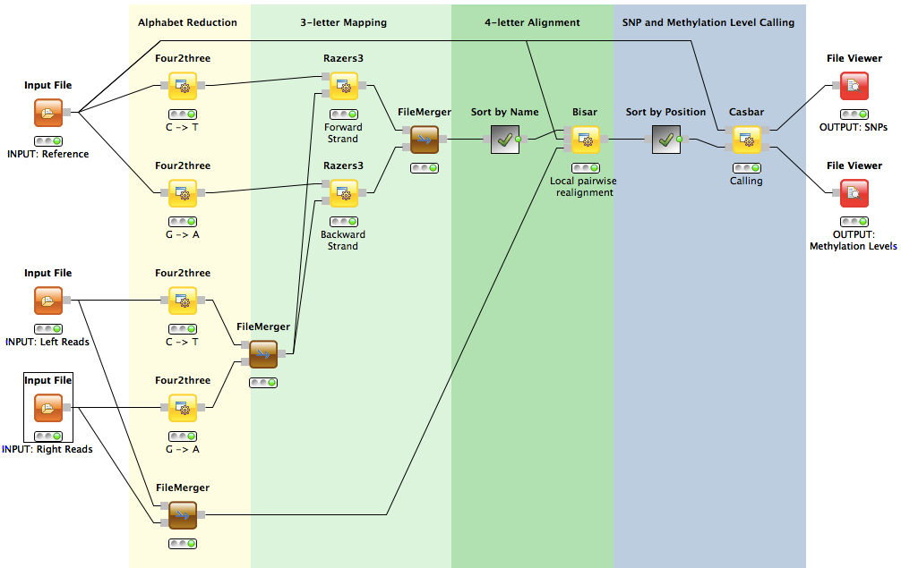

BS-Seq Workflow
===============

This workflow is designed for the analysis of BS-Seq data, from bisulfite read mapping to SNP and methylation level calling at single-nucleotide resolution.

Description
-----------

The workflow addresses the specific challenges arising from the bisulfite treatment which converts unmethylated C´s to T´s, assuming the directional protocol (Lister et al. 2008).

For the read mapping a three-letter approach is applied making use of the all-mapper RazerS 3. Therefore both the read and the reference alphabets are first reduced (by either C->T or G->A conversions) followed by a corresponding mapping in order to analyse the forward and backward DNA methylations.
The three-letter mapping locations are then post-processed by the tool Bisar.
Bisar makes use of the full four-letter space and performs a local pairwise realignment using an advanced statistical method.
The alignment scoring scheme incorporates the global methylation rate, the bisulfite conversion rate and base qualities combined with base dependent sequencing error frequencies.
Mapping qualities are computed and after the final verification step only unique four-letter alignments are given out in a SAM file.

These alignments are used in the subsequent tool Casbar for a simultaneous SNP and methylation level calling.
A Bayesian model is used to compute the posterior probability for each possible genotype under the observed data and a given methylation level.
The methylation level maximizing the posterior probability is determined and the genotype with the highest probability is chosen.  
Again the bisulfite conversion rate and base qualities combined with base dependent sequencing error frequencies are incorporated.
All called SNPs and methylation levels that pass the verification criteria are given out in a VCF and BED file respectively. 

Prerequisites
-------------

Make sure that the following prerequisites are installed:
- SeqAn NGS ToolBox (see [installation instructions](http://trac.seqan.de/wiki/HowTo/UseSeqAnNodesInKnime#InstallSeqAninKNIME))

Example Data
------------

Extract the example_data.zip file and configure the three *Input File* nodes accordingly:

<dl>
  <dt>Genome</dt>
  <dd><ul>
  <li>hg18_chr21_micro.fa</li>
  </ul>
  Small sequence of 300kb sampled from human chr21.</dd>
  <dt>Left and Right Reads</dt>
  <dd><ul>
  <li>reads_pe_N48000.L.fastq.fa</li>
  <li>reads_pe_N48000.R.fastq.fa</li>
  </ul>
  Simulated reads from methylated haplotypes.</dd>
</dl>  

Output
------

Output is a VCF file containing the detected SNPs and a BED file containing the detected methylation levels.

Contact
-------

If you have any further questions or comments please contact:
 * [Sabrina Krakau](mailto:sabrina.krakau@fu-berlin.de)
 * [David Weese](mailto:david.weese@fu-berlin.de)
 
References
----------

Sabrina Krakau. *Developing a BS-Seq Analysis Workflow for Genomic Variation and Methylation Level Calling*, [MSc Thesis](http://www.mi.fu-berlin.de/en/inf/groups/abi/theses/master_dipl/krakau/msc_thesis_krakau.pdf)
