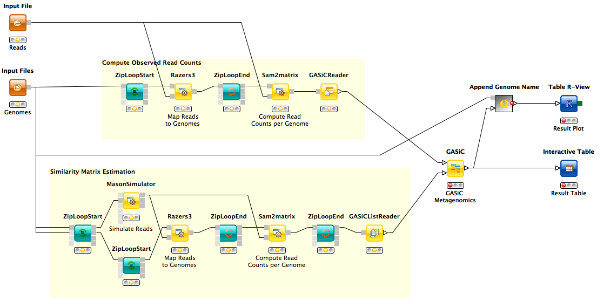

GASiC Metagenomics Workflow
===========================

<b>G</b>enome <b>A</b>bundance <b>Si</b>milarity <b>C</b>orrection workflow.

Description
-----------

One goal of sequencing based metagenomic analysis is the quantitative taxonomic assessment of microbial community compositions. However, the majority of approaches either quantify at low resolution (e.g. at phylum level) or have severe problems discerning highly similar species. Yet, accurate quantification on species level is desirable in applications such as metagenomic diagnostics or community comparison. GASiC is a method to correct read alignment results for the ambiguities imposed by similarities of genomes. It has superior performance over existing methods.

Example Data
------------

Extract the bee_example.zip file and configure the two *Input File* nodes accordingly:

<dl>
  <dt>Reads</dt>
  <dd><ul>
  <li>SRR059298_72_subset.fasta</li>
  </ul>
  First 100k x 72bp reads of <href="http://sra.dnanexus.com/runs/SRR059298">SRR059298</href> dataset. Whole viral genome sequence from bees infected by Varroa mites from WHRI apiary 2009.</dd>
  <dt>Genomes</dt>
  <dd><ul>
  <li>dwv.fasta</li>
  <li>vdv-1-dwv-5.fasta</li>
  <li>vdv-1-dwv-9.fasta</li>
  <li>vdv1.fasta</li>
  </ul>
  Deformed Wing Virus (DWV), Varroa destructor virus-1 (VDV1) and recombinants of both.</dd>
</dl>  

References
----------

**Original Paper:**
  Martin S. Lindner and Bernhard Y. Renard. *Metagenomic abundance estimation and diagnostic testing on species level*, Nucl. Acids Res. 2013, 41(1): e10, [doi:10.1093/nar/gks803](http://nar.oxfordjournals.org/content/41/1/e10)
