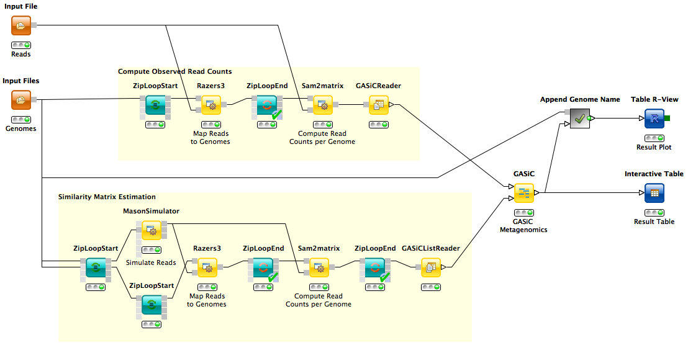

GASiC Metagenomics Workflow
===========================

**G**enome **A**bundance **Si**milarity **C**orrection workflow.

Description
-----------

One goal of sequencing based metagenomic analysis is the quantitative taxonomic assessment of microbial community compositions. However, the majority of approaches either quantify at low resolution (e.g. at phylum level) or have severe problems discerning highly similar species. Yet, accurate quantification on species level is desirable in applications such as metagenomic diagnostics or community comparison. GASiC is a method to correct read alignment results for the ambiguities imposed by similarities of genomes. It has superior performance over existing methods.

Example Data
------------

References
----------

**Original Paper:**
  Martin S. Lindner and Bernhard Y. Renard. *Metagenomic abundance estimation and diagnostic testing on species level*, Nucl. Acids Res. 2013, 41(1): e10, doi:10.1093/nar/gks803
