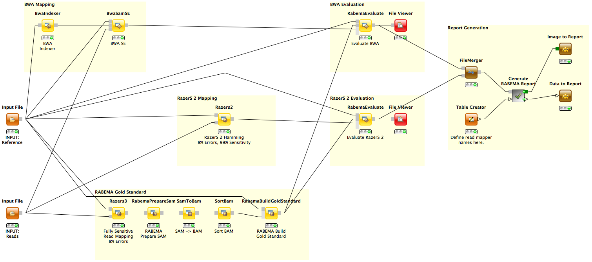

Rabema Example Workflow
=======================

A workflow to benchmark the sensitivity of read mappers.

Description
-----------

Rabema is a program that supports a new read mapper benchmark methodology. The methodology is based on a strict definition of the read mapping problem and allows the evaluation of arbitrary read mapping programs that create SAM output.
The paper gives an explanation of the theory behind the benchmark methodology with an example evaluation.

This workflow can be devided into 3 parts: gold standard generation, read mapping and evaluation. In this example, bwa with default parameters and razers2 in no-gaps mode with 99% sensitivity are analyzed. The benchmark results of both mappers can be viewed with two *File Viewer* nodes.

Example Data
------------

Extract the two .bz2 files and configure the two *Input File* nodes accordingly:

<dl>
  <dt>INPUT Reference</dt>
  <dd>genome.fa - S.cerevisiae reference genome.</dd>

  <dt>INPUT Reads</dt>
  <dd>SRR003673.10k.fastq - The first 10k reads of length 36bp of a S.cerevisiae sample. Sequenced with the Illumina Genome Analyzer.</dd>
</dl>  

References
----------

**Rabema Website:**
  http://www.seqan.de/projects/rabema

**Original Paper:**
  M. Holtgrewe, A.-K. Emde, D. Weese and K. Reinert. *A Novel And Well-Defined Benchmarking Method For Second Generation Read Mapping*, BMC Bioinformatics 2011, 12:210, doi:10.1186/1471-2105-12-21.
