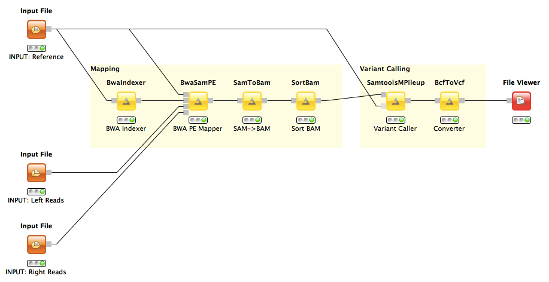

Variant Calling with BWA and mpileup
====================================

A variant calling workflow based on the BWA read mapper and the SAMtools mpileup variant caller.

Description
-----------

This workflow detects small variations like SNPs or indels of a paired-end sequenced sample genome in comparison to a given reference genome. The input is a reference genome in Fasta format and two read files of *left* and *right* ends (can be interchanged) of the sequenced paired-end reads in Fasta or Fastq format. Output is a text file in VCF format whose lines contain the detected variants.

The workflow consists of a read mapping step where BWA is used to index the genome and map reads onto it. The read alignments are then converted from SAM to BAM format and sorted by genomic position. In the second step the read alignments are transposed into the pileup format which for each genomic position stores the read bases that are aligned to it. From the set of bases deviating from the reference genome mpileup calls variants and outputs them in BCF format which is finally converted to the human-readable VCF format.

Example Data
------------

Configure the three *Input File* nodes accordingly:

<dl>
  <dt>INPUT Reference</dt>
  <dd>NC_008253_1K.fa - First 1kb of the E.coli genome.</dd>

  <dt>INPUT Left Reads</dt>
  <dd>sim_reads_l.fq - 1k left reads of length 70bp paired-end reads of a simulated haplotype.</dd>
  
  <dt>INPUT Right Reads</dt>
  <dd>sim_reads_r.fq - 1k right reads of length 70bp reads of 10k paired-end reads of a simulated haplotype.</dd>
</dl>  

Contact
-------

If you have any further questions or comments please contact:
 * [David Weese](mailto:david.weese@fu-berlin.de)

References
----------

**BWA Website:**
  http://bio-bwa.sourceforge.net

**mpileup Website:**
  http://samtools.sourceforge.net/mpileup.shtml
