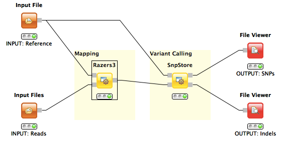

Variant Calling with SnpStore
=============================

A variant calling workflow based on the read mapper RazerS 3 and the variant caller SnpStore.

Description
-----------

This workflow detects small variations like SNPs or indels of a paired-end sequenced sample genome in comparison to a given reference genome. The input is a reference genome in Fasta format and two read files of *left* and *right* ends (can be interchanged) of the sequenced paired-end reads in Fasta or Fastq format. Output is a text file in VCF format whose lines contain the detected SNPs and a text file containing the detected indels.

The workflow consists of a read mapping step where RazerS 3 is used to directly map reads to the genome and output the alignment in SAM format.
In the second step the output of RazerS 3 is given to SnpStore which realigns reads at potential indel sites and uses deviations between reads and the genome to call variants which are written in the human-readable VCF and GFF formats.

The second workflow adds a prior error correction step that uses Fiona to automatically correct sequencing errors. Note, that the workflow now contains a variable GenomeLength which is required by Fiona and must be set accordingly (1000 in the example).

Example Data
------------

Configure the three *Input File* nodes accordingly:

<dl>
  <dt>INPUT Reference</dt>
  <dd><ul>
  <li>NC_008253_1K.fa</li>
  </ul>
  First 1kb of the E.coli genome.</dd>
  <dt>INPUT Reads</dt>
  <dd><ul>
  <li>sim_reads_l.fq</li>
  <li>sim_reads_r.fq</li>
  </ul>
  2 x 1k Left and right reads each of length 70bp paired-end reads of a simulated haplotype.</dd>
</dl>  

References
----------

**Fiona Website:**
  http://www.seqan.de/projects/fiona/

**RazerS 3 Website:**
  http://www.seqan.de/projects/razers/

**RazerS 3 Paper:**
  Weese, D., Holtgrewe M., and Reinert, K. (2012). *RazerS 3: Faster, fully sensitive read mapping.* Bioinformatics, 28(20), 2592–2599.

**SnpStore Website:**
  http://www.seqan.de/projects/snpstore/

